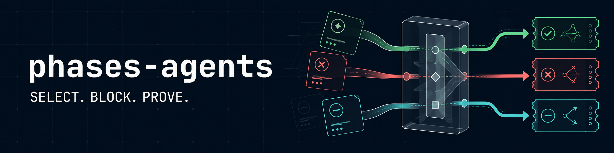
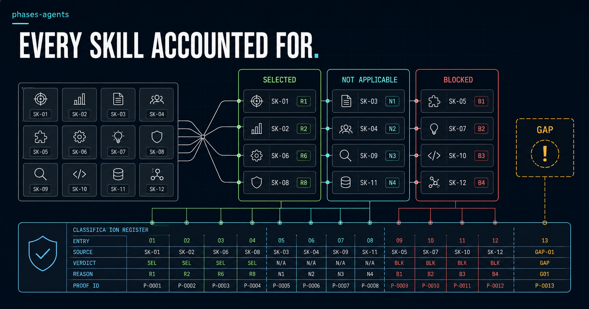

# phases-agents

*English · [Français](README.fr.md)*



A local MCP server that discovers, validates and selects skills
deterministically. Python standard library only, no runtime dependencies.

One server. Five tools. Nothing executed behind your back.

## Why

AI agents improvise. Ask the same question twice and you get two different
plans. That is fine for brainstorming, and unacceptable for audit and
compliance work.

phases-agents removes the improvisation. It profiles a local project,
validates a catalogue of skills against a strict contract, and returns a plan
that can be replayed. Same target, same catalogue, same parameters, same
decision.

## Principle


```text
configured root identifiers
→ bounded discovery
→ official validation
→ immutable registry
→ verified cache
→ detector profile
→ deterministic selection
→ MCP plan
```

The server selects and exposes. The calling model reads the selected skills
and decides what to do with them, using its own tools. **The server never
executes a skill.**

## Architecture

| File | Role |
|---|---|
| `validator.py` | official contracts and validated snapshots |
| `skill_loader.py` | bounded local discovery |
| `skill_runtime.py` | trusted roots and verified cache |
| `skill_types.py` | immutable types and limits |
| `registry.py` | validated, immutable registry |
| `detector.py` | local profile of the target |
| `planner.py` | deterministic selection and ordering |
| `server.py` | JSON-RPC/MCP transport |
| `capabilities.py` | client capability vocabulary |
| `profile_facts.py` | versioned profile-fact vocabulary |
| `skill_gaps.py` | gap rules (`skills_missing`) |

The normative contract lives in `core/SKILLS_CONTRACT.md` (French).

## Quick start

An example package ships in `examples/skills/`. Three steps produce a real
plan.

```bash
git clone https://github.com/Cherridsaid/phases-agents && cd phases-agents
```

Create `skills-roots.json` pointing at the example root:

```json
{
  "config_version": "1.0",
  "roots": [
    { "id": "demo", "path": "/absolute/path/to/phases-agents/examples/skills" }
  ]
}
```

```bash
python server.py --skills-config /absolute/path/to/skills-roots.json
```

The server reads JSON-RPC line by line on standard input. A
`phases_agents_plan` call against a Python project then selects
`hello-python`:

```json
{"jsonrpc":"2.0","id":1,"method":"tools/call","params":{"name":"phases_agents_plan",
 "arguments":{"root_ids":["demo"],"target":"/absolute/path/to/a/project",
 "today":"2026-08-27","plan_version":"B3",
 "client_capabilities":["filesystem_read","filesystem_search"]}}}
```

Two plan formats coexist. `"B3"` names the versioned **format**, not a server
version; its official schema is `core/PLAN_B3_SCHEMA.json`. Use it for new
work. Without `plan_version`, the legacy format returns a flat list of steps;
it is kept so existing callers do not break, and will be deprecated before
removal. `client_capabilities` is only accepted in B3, since declaring what
the client can do only makes sense in that format.

### Connecting an MCP client

Claude Code (`.mcp.json` at the root of your project):

```json
{
  "mcpServers": {
    "phases-agents": {
      "command": "python",
      "args": [
        "/absolute/path/to/phases-agents/server.py",
        "--skills-config",
        "/absolute/path/to/skills-roots.json"
      ]
    }
  }
}
```

Codex uses the same command/arguments pair in its own configuration file. No
token and no environment variable is required.

## MCP tools

```text
detect(target)
list_skills(root_ids, today)
get_skill(root_ids, today, skill_id)
plan(root_ids, target, today, constraints?)
plan(root_ids, target, today, plan_version, client_capabilities?)
refresh_skills(root_ids, today)
```

`today` is injected rather than read from a clock, so every call is
replayable. `get_skill` takes an identifier, never a path, and its content
comes from the validated snapshot. Absolute paths and detected secrets are
masked in public output. Any encoded JSON-RPC response stays under 1 MiB.

The first call builds the validated registry. Warm calls verify metadata
without re-reading contents. `refresh_skills` forces a rebuild.

## Writing a skill package

Each package is a direct child of a root and contains at least:

```text
<root>/<skill-id>/SKILL.md
<root>/<skill-id>/phases.json
```

The fastest way to start is to copy `examples/skills/hello-python/` and rename
the identifier.

### SKILL.md frontmatter

Five keys are allowed. All optional, all checked when present.

| Key | Constraint |
|---|---|
| `name` | must equal `phases.json.id` |
| `description` | bounded free text |
| `version` | must equal `phases.json.version` |
| `owner` | free author identity, no invisible characters |
| `license` | `Apache-2.0`, `MIT`, `BSD-2-Clause` or `BSD-3-Clause` |

### The fourteen required sections

Each is a Markdown heading (`##`), in any order. **Section titles are French**,
because they belong to the contract; the body is yours to write in any
language.

`Loi centrale` · `Ce que ce skill fait` · `Ce que ce skill ne fait pas` ·
`Conditions d'activation` · `Conditions d'exclusion` ·
`Capacites necessaires` · `Interdictions` · `Methode d'audit` ·
`Contrat de preuve` · `Format de sortie` · `Conditions de blocage` ·
`Limites connues` · `Exemples d'entree` · `Exemple de sortie attendue`

### phases.json fields

All required: `schema_version`, `id`, `version`, `title`, `description`,
`domain`, `project_types`, `platforms`, `activation`, `exclusions`,
`requires_capabilities`, `optional_capabilities`, `forbidden_capabilities`,
`execution_mode`, `human_approval`, `output_schema`, `rules_path`,
`references_path`, `scripts_path`, `tests_path`, `files`.

`output_schema` uses the symbolic form `core:SCHEMA_NAME.json`.

### Closed vocabularies

`project_types` must intersect what the detector can emit: `apk`, `python`,
`skill_package`, `solana`, `web`.

`activation.any` uses profile facts: `collects_personal_data`, `has_api`,
`has_apk`, `has_authentication`, `has_database`, `has_ecommerce`,
`has_eu_context`, `has_file_upload`, `has_javascript`, `has_python`,
`has_rust`, `has_skill_packages`, `has_solana`, `has_source_code`,
`has_typescript`, `has_web`, `uses_ai`, `uses_payments`.

`requires_capabilities`, `optional_capabilities` and
`forbidden_capabilities` use: `browser`, `dependency_installation`,
`filesystem_read`, `filesystem_search`, `filesystem_write`, `human_question`,
`shell`, `target_code_execution`, `web`.

**Provided** capabilities are an **open** vocabulary: each catalogue names what
it brings, and only the shape is enforced (`^[a-z][a-z0-9_]{0,63}$`). Only
**client** capabilities are closed, because they describe the protocol rather
than your domain.

A `domain` of `legal`, `juridique`, `regulatory` or `compliance` triggers an
extra regime: every rule cited must carry an official source, a jurisdiction
and a verification date.

### What the schema does and does not say

`SKILL_MANIFEST_SCHEMA.json` describes the **shape** of `phases.json`:
required fields, types, closed vocabularies.

The schema engine is deliberately minimal. It applies `enum`, `minLength` and
`minItems`, and nothing else: no `pattern`, no `if`/`then`, no `oneOf`. A
schema using those keywords would itself be rejected.

The consequence matters: **conditional rules live in `validator.py`**, which
remains the source of truth. The version rule is the example —
`provides_capabilities` is *forbidden* in a `1.0` manifest and *required* in a
`1.1` one. That rule is enforced and tested, but it is not expressible in the
schema. Do not read `required` as the whole contract.

A package with only `SKILL.md` fails. An invalid package blocks the registry
rather than degrading silently.

## Identity

`phases.json.id` is the identity, and `SKILL.md.name` must match it. The
directory must carry the same key. Keys are normalised with NFKC then
`casefold`, so homoglyphs cannot smuggle in a second identity. Any collision
blocks the whole build; no package is elected arbitrarily.

## Selection



Every valid skill in the registry lands in exactly one category, with its
reason. Nothing is discarded silently.

The only proven automatic signal is:

```text
project_types ∩ profile.types
```

Platform, domain and capabilities filter only when the caller supplies those
constraints. A forbidden capability rejects the skill. No semantic score is
invented, and the plan is sorted by identifier.

An empty plan is explicitly valid: it carries `NO_COMPATIBLE_SKILL`.

The `B3` plan classifies every installed skill across `skills_selected`,
`skills_not_applicable` and `skills_blocked`; each skill appears exactly once.
`skills_missing` lists capabilities with no executable provider, derived from
confirmed facts only. **A gap never proves non-compliance** — it says an audit
deemed necessary is not covered.

## Limits

- 16 roots maximum
- direct depth only
- 1,000 packages maximum
- 10,000 entries per root
- `SKILL.md` capped at 256 KiB
- a single reference capped at 256 KiB, 1 MiB in total
- snapshots capped at 16 MiB
- public result capped at 1 MiB
- 100 issues per package
- fingerprint capped at 100,000 nodes

Callers may only lower these limits, never raise them.

## Runtime constraints

- Python `>=3.11`
- no third-party runtime dependency
- no implicit network
- no runtime shell
- no target code executed
- no implicit clock
- no telemetry
- no skill downloaded

`pytest` is a development dependency only.

## Tests

```bash
python -m pytest -q
```

Expected result:

```text
729 passed, 2 skipped
0 failed
```

Normative texts are checked out with LF endings, enforced by `.gitattributes`.
A couple of Windows symlink tests are skipped: they need a local Windows
privilege. Windows junctions are genuinely tested.

## Level of proof

The validator confirms one thing only:

```text
STRUCTURALLY_VALIDATED
```

It does not verify the real target. `TARGET_VERIFIED` stays forbidden in V1.

## Security

The loader refuses reparse points. Reads are bounded and confined. Output is
sorted and deterministic.

One design decision deserves your attention: `detect` and `plan` take a
`target` path that is **not** confined to the configured roots, because the
point is to profile an arbitrary project. Run this server under an account
whose reach you accept, and connect it only to a trusted client. The full
threat model is in [SECURITY.md](SECURITY.md).

## Non-guarantees

- no universal semantic relevance
- no external skill approved automatically
- no audit of script contents
- no genuinely mounted target proof
- no total Windows atomicity
- no universal HTML recognition
- no universal secret detection
- no guaranteed legal compliance
- no marketplace, no remote source

## Licence

Apache-2.0. See `LICENSE` and `NOTICE`.
